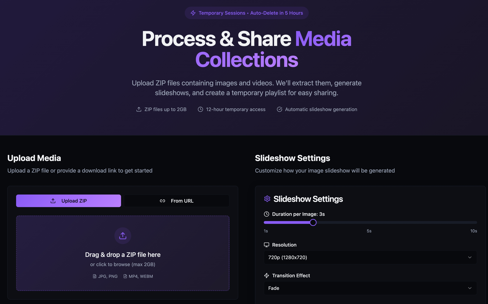

# 📁 Media ZIP Showcase

A full-stack web application for processing, sharing, and previewing ZIP files containing images, videos, and audio. Upload ZIP files or provide download links, and the system will extract media, generate slideshows, and create temporary playlists for easy sharing.

---


## ✨ Features

### Core Functionality

- **ZIP Upload & Link Submission**: Upload ZIP files (up to 2GB) or provide public/Google Drive URLs.
- **Media Extraction & Classification**: Automatically extracts and categorizes images, videos, and audio files.
- **Slideshow Generation**: Creates MP4 slideshows from images with customizable settings (duration, resolution, transitions, background music).
- **Temporary Sessions**: Each session is auto-expiring (12 hours for media, 24 hours for metadata).
- **Real-time Status**: Live progress tracking and status updates for uploads and processing.
- **Session Management**: View, delete, and auto-cleanup sessions from the UI.

### Slideshow Customization

- **Duration Control**: 0.5–10 seconds per image.
- **Resolution Options**: 1280x720 (HD) or 1920x1080 (Full HD).
- **Transitions**: None, Fade, or Crossfade effects.
- **Background Music**: Optional audio overlay from uploaded files.

### Security & Reliability

- **Path Traversal & ZIP Bomb Protection**: Prevents malicious archives and directory traversal.
- **File Validation**: Strict file type and size limits, magic number validation.
- **Rate Limiting**: Upload and link submission rate limits.
- **Input Sanitization**: Filename and URL validation.
- **CORS Protection**: Configurable origin restrictions.
- **Session Security**: Secure UUID4 session IDs, automatic expiration, no guessable identifiers.

### Cleanup & Maintenance

- **Auto-Cleanup**: Media files deleted after 12 hours, metadata after 24 hours.
- **Manual Cleanup**: "Cleanup All Media" button in the UI and `/api/cleanup` endpoint.
- **Scheduled Cleanup**: Celery Beat runs cleanup every 30 minutes.

### User Experience

- **Modern React Frontend**: Responsive, mobile-friendly UI.
- **Drag-and-Drop Upload**: Easy ZIP file upload with progress feedback.
- **Session Viewer**: Browse, preview, and download extracted media.
- **Slideshow Progress**: See slideshow generation status and browse other media while waiting.

---

## 🛠️ API Endpoints

### Upload & Processing

- `POST /api/upload` — Upload a ZIP file.
- `POST /api/submit_link` — Submit a download URL (public or Google Drive).
- `GET /api/session/{id}` — Get session status and manifest.
- `GET /api/sessions` — List all active sessions.

### Media Access

- `GET /api/media/{session_id}/{filename}` — Download a specific media file.
- `GET /session/{session_id}` — Static session viewer (HTML).

### Cleanup

- `GET /api/cleanup` — Delete all media and session metadata (manual cleanup).

---

## 🖼️ Supported File Formats

- **Images**: `.jpg`, `.jpeg`, `.png`, `.gif`, `.bmp`, `.webp`
- **Videos**: `.mp4`, `.webm`, `.avi`, `.mov`, `.mkv`
- **Audio**: `.mp3`, `.wav`, `.ogg`, `.aac`, `.flac`

---

## 🔧 Configuration

### Environment Variables

See `backend/config.example.env` for all options.

```bash
# File Limits
MAX_FILE_SIZE=2147483648        # 2GB upload limit
MAX_EXTRACTED_SIZE=1073741824   # 1GB extraction limit

# Session TTL
MEDIA_SESSION_TTL=43200         # 12 hours (media files)
METADATA_SESSION_TTL=86400      # 24 hours (session data)

# Security
CORS_ORIGINS=http://localhost:5173,http://127.0.0.1:5173
RATE_LIMIT_UPLOADS=5/minute
RATE_LIMIT_LINKS=10/minute

# Redis
REDIS_URL=redis://localhost:6379/0
```

---

## 🏗️ Project Structure

```
media-zip-showcase/
├── backend/                    # FastAPI backend
│   ├── app.py                 # Main FastAPI application
│   ├── tasks.py               # Celery background tasks
│   ├── models.py              # Pydantic data models
│   ├── config.py              # Configuration management
│   ├── utils/                 # Utility modules
│   │   ├── downloader.py      # URL/Google Drive download
│   │   ├── media_processor.py # File classification
│   │   └── slideshow_generator.py # Video generation
│   ├── static/                # Static files (built frontend)
│   ├── sessions/              # Session metadata JSON files
│   ├── requirements.txt       # Python dependencies
│   └── docker-compose.yml     # Docker configuration
├── frontend/                  # React TypeScript frontend
│   ├── src/
│   │   ├── pages/            # Main pages (Index, SessionView)
│   │   ├── components/       # Reusable UI components
│   │   ├── hooks/            # Custom React hooks
│   │   └── lib/              # API client and utilities
│   └── package.json          # Node.js dependencies
└── README.md                 # This file
```

---

## 🚀 Quick Start

### Prerequisites

- Python 3.8+
- Node.js 16+
- Redis
- FFmpeg (for video processing)

### 1. Backend Setup

```bash
cd backend
pip install -r requirements.txt
cp config.example.env .env
redis-server
python -c "from config import ensure_directories; ensure_directories()"
uvicorn app:app --reload --host 0.0.0.0 --port 8000
```

### 2. Start Background Workers

```bash
# In separate terminals:
celery -A tasks.celery_app worker --loglevel=info
celery -A tasks.celery_app beat --loglevel=info
```

### 3. Frontend Setup

```bash
cd frontend
npm install
npm run dev
```

### 4. Access Application

- **Main App**: http://localhost:5173
- **API Docs**: http://localhost:8000/docs
- **Static Session Viewer**: http://localhost:8000/session/{session_id}

---

## 🐋 Docker Deployment

```bash
cd backend
docker-compose up --build
```

- **Backend**: FastAPI server (port 8000)
- **Worker**: Celery worker for background processing
- **Beat**: Celery beat for scheduled cleanup
- **Redis**: Message broker and result backend

---

## 🔄 Session Lifecycle

1. **Queued**: Session created, background job scheduled.
2. **Downloading**: Downloading from URL (if applicable).
3. **Processing**: Extracting ZIP, classifying media, generating slideshow.
4. **Ready**: Session complete, media accessible.
5. **Failed**: Error occurred during processing.

---

## 🧹 Cleanup System

- **Media Files**: Auto-deleted after 12 hours.
- **Session Metadata**: Auto-deleted after 24 hours.
- **Manual Cleanup**: `/api/cleanup` endpoint and UI button.
- **Scheduled Cleanup**: Celery Beat runs cleanup every 30 minutes.

---

## 🔒 Security Measures

- **ZIP bomb protection** with extraction size limits.
- **Path traversal prevention** and filename sanitization.
- **Magic number validation** for file types.
- **Rate limiting** on upload and link endpoints.
- **CORS origin restrictions**.
- **URL validation** for downloads.
- **Private IP address blocking**.
- **Secure UUID4 session IDs** and automatic session expiration.

---

## 🐛 Troubleshooting

### Common Issues

- **Redis Connection Error**: Ensure Redis is running (`redis-server`).
- **FFmpeg Not Found**: Install FFmpeg (`sudo apt install ffmpeg` or `brew install ffmpeg`).
- **Permission Errors**: Ensure proper permissions for media directories (`chmod -R 755 backend/static/`).

### Development Tips

- Use `uvicorn app:app --reload` for auto-reloading during development.
- Monitor Celery workers with `celery -A tasks.celery_app events`.
- Check Redis status with `redis-cli ping`.

---

## 📝 License

This project is provided as-is for educational and demonstration purposes.

---

## 🤝 Contributing

1. Fork the repository.
2. Create a feature branch.
3. Make your changes.
4. Test thoroughly.
5. Submit a pull request. 